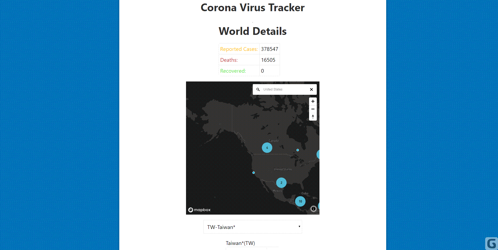
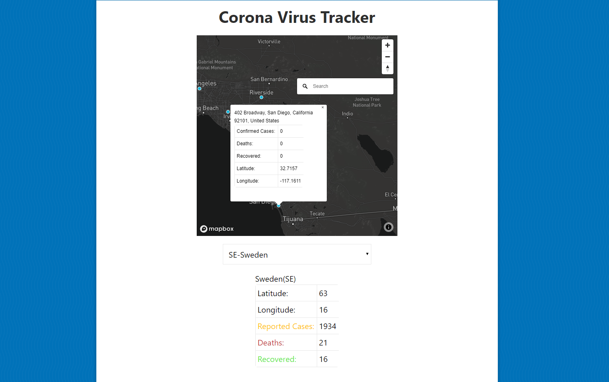

# Corona-Virus-Vanilla-JS-Mapbox

# Images 

## Clustering of Points 

Corona Virus Tracker Application using Vanilla JavaScript shows how many deaths are there, how many people recovered and how many cases were reported as Corona Positive. 
