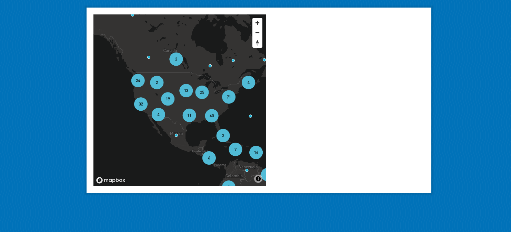

# Corona-Virus-Vanilla-JS-Mapbox

# Images 

## Clustering of Points 

## Select a Location from the Map, it will tell the detail of the deaths, reported and recovered cases for a specific location of a country on the map 
## For country as a whole, select your country from the dropdown and see the results in the table 

Corona Virus Tracker Application using Vanilla JavaScript shows how many deaths are there, how many people recovered and how many cases were reported as Corona Positive. 

## Made using Pure Vanilla JavaScript [No frameworks] and the Mapbox GL-JS
